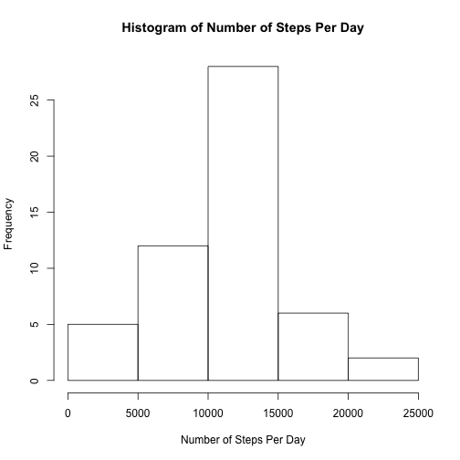
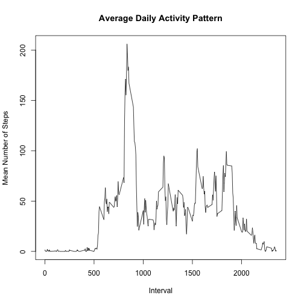
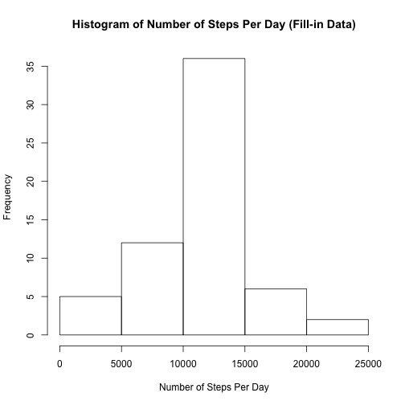

# Reproducible Research: Peer Assessment 1

### Course information  
Coursera: Reproducible Research  
Professors: Roger D. Peng, PhD; Jeff Leek, PhD; Brian Caffo, PhD  
[Course website][courselink]  

### Data  
The data for this assignment can be downloaded from the course web site:  
* Dataset: [Activity monitoring data][datalink] (52K)

The variables included in this dataset are:  
* **steps**: Number of steps taking in a 5-minute interval (missing values are coded as `NA`)  
* **date**: The date on which the measurement was taken in YYYY-MM-DD format  
* **interval**: Identifier for the 5-minute interval in which measurement was taken  

The dataset is stored in a comma-separated-value (CSV) file and there are a total of 17,568 observations in this dataset.  

## Loading and preprocessing the data
Read in data file:

```r
data <- read.csv("activity.csv")
```

Convert date values to Date type:

```r
data$date <- as.Date(data$date, "%Y-%m-%d")
```

## What is mean total number of steps taken per day?
Calculate the number of steps taken each day:

```r
sum_per_day <- aggregate(steps ~ date, data=data, sum)
```

Make a histogram of the total number of steps taken each day:

```r
hist(sum_per_day$steps, xlab="Number of Steps Per Day", 
     main="Histogram of Number of Steps Per Day")
```

 

Calculate and report the **mean** and **median** total number of steps taken per day:

```r
mean_per_day <- round(mean(sum_per_day$steps))
median_per_day <- round(median(sum_per_day$steps))
```

The **mean** total number of steps per day is 1.0766 &times; 10<sup>4</sup>.  
The **median** total number of steps per day is 1.0765 &times; 10<sup>4</sup>.

## What is the average daily activity pattern?
Calculate the mean number of steps taken during each interval:  

```r
mean_per_interval <- aggregate(steps ~ interval, data=data, mean)
```

Make a time series plot (i.e. `type = "l"`) of the 5-minute interval (x-axis) and the average number of steps taken, averaged across all days (y-axis)  

```r
plot(mean_per_interval$interval, mean_per_interval$steps, type="l",
     xlab="Interval", ylab="Mean Number of Steps", 
     main="Average Daily Activity Pattern")
```

 

Which 5-minute interval, on average across all the days in the dataset, contains the maximum number of steps?  

```r
max_interval <- mean_per_interval$steps==max(mean_per_interval$steps)
mean_per_interval[max_interval,]$interval
```

```
## [1] 835
```


## Imputing missing values
Calculate and report the total number of missing values in the dataset (i.e. the total number of rows with `NA`s):

```r
numNA <- sum(is.na(data$steps))
numNA
```

```
## [1] 2304
```

Devise a strategy for filling in all of the missing values in the dataset. The strategy does not need to be sophisticated. For example, you could use the mean/median for that day, or the mean for that 5-minute interval, etc.

Fillin `NA` values with mean for that 5-minute interval:  

```r
## create a list of rows with data to impute
to_impute <- grep(TRUE, is.na(data$steps))

##copy "data" dataframe to "fillin_data" dataframe
fillin_data <- data

##for each index in impute list, replace the NA value with the mean
## number of steps for that interval from the mean_per_interval dataframe
for (i in to_impute){
    fillin_data[i,]$steps <- mean_per_interval[(mean_per_interval$interval == 
                                               fillin_data[i,]$interval),]$steps
}
```

Calculate the number of steps taken each day:

```r
sum_per_day_fillin <- aggregate(steps ~ date, data=fillin_data, sum)
```

Make a histogram of the total number of steps taken each day:

```r
hist(sum_per_day_fillin$steps, xlab="Number of Steps Per Day", 
     main="Histogram of Number of Steps Per Day (Fill-in Data)")
```

 

Calculate and report the **mean** and **median** total number of steps taken per day:

```r
mean_per_day_fillin <- round(mean(sum_per_day_fillin$steps))
median_per_day_fillin <- round(median(sum_per_day_fillin$steps))
```

The **mean** total number of steps per day is 1.0766 &times; 10<sup>4</sup>.  
The **median** total number of steps per day is 1.0766 &times; 10<sup>4</sup>.

Do these values differ from the estimates from the first part of the assignment?  
**The median value for the fillin data has increased by 1 step per day.**  
Please see summary table below:

|data        |  mean| median|
|:-----------|-----:|------:|
|data        | 10766|  10765|
|fillin_data | 10766|  10766|


## Are there differences in activity patterns between weekdays and weekends?


[datalink]: https://d396qusza40orc.cloudfront.net/repdata%2Fdata%2Factivity.zip
[courselink]: https://class.coursera.org/repdata-004/
